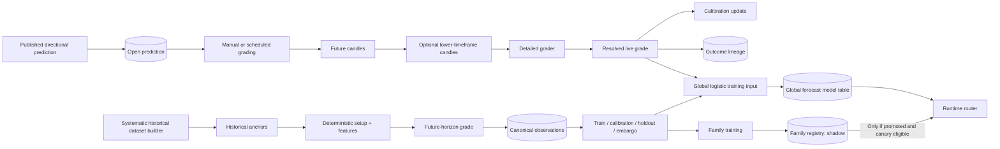
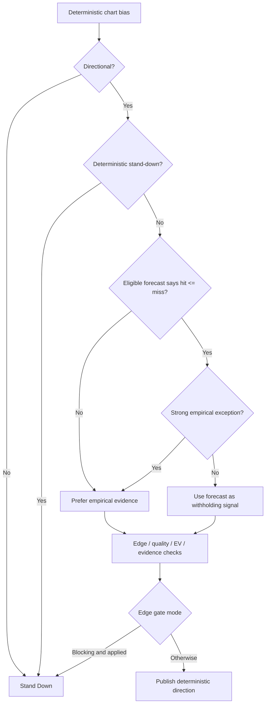

# TRNDLINE Insight — Thursday Discovery Report


**Branch / commit inspected:** `main` at `54c4b236`

**Primary objective:** Understand how TRNDLINE Insight actually works today, verify the supplied system guide against the repository, and identify the questions that need deeper investigation on Friday.

**Scope:** Discovery and architecture verification. I did not make production code changes.


## 1.  Summary


The clearest way I now understand TRNDLINE Insight is:

> TRNDLINE Insight is a layered chart-reading and probabilistic decision-support system. It takes a point-in-time market snapshot, produces a deterministic chart interpretation, checks historical evidence and eligible model forecasts, decides whether there is enough evidence to publish a directional practice call or stand down, and later grades valid predictions so calibration and models can improve.

The most important thing I learned is that Insight is **not one AI model**. The system has several separate responsibilities:

1. User entry and frontend state.
2. Market-data acquisition and candle selection.
3. Deterministic chart analysis.
4. Historical calibration.
5. Feature generation.
6. Forecast/model routing.
7. Publish-versus-stand-down policy.
8. Contracts and lineage.
9. Prediction persistence.
10. Grading.
11. Dataset construction.
12. Training and model serving.


The most important Thursday concerns were:

- point-in-time integrity around higher-timeframe data and historical calibration;
- multiple frontend/server/fallback paths rather than one uniform path;
- LightGBM training existing without a verified compatible Node inference path;
- different global and family-model training/serving lifecycles;
- incomplete reproducibility from persisted lineage alone;
- neutral/range outcomes being trainable at the grader level but not clearly reaching the verified training paths;
- multiple publish/stand-down fields and two policy passes.


# 2. How I Approached the Discovery

I deliberately worked from the outside of the system inward.

I did not want to start by reading the model code and assume that the model was the core of the product. I used this sequence:

1. **Understand the product from the user's perspective.**
2. **Run Insight locally.**
3. **Trace one concrete request end-to-end.**
4. **Follow the market data and candle boundaries.**
5. **Understand deterministic analysis before ML.**
6. **Trace calibration, features, model routing, and the final decision.**
7. **Follow a prediction after the user sees it: persistence, grading, dataset, training, serving.**
8. **Compare the verified implementation with the supplied guide.**
9. **Separate facts from concerns and turn the concerns into Friday questions.**

Several things that looked simple in the architecture guide were not simple in the implementation. For example, “model routing” is not just choosing one model, “calibration fallback” does not operate exactly as the guide implies, and “prediction lifecycle” actually has two learning data sources rather than one simple linear chain.


# 3. Architecture Diagram of Insight

## 3.1 Verified Runtime Architecture

```mermaid
flowchart LR
    U[User] --> TL[Trading Lab]
    U --> COMP[Ask TRNDLINE / Companion]
    U --> SCRIPT[Script Studio Insight]
    U --> STORED[Stored Insight / predictionId]

    TL --> REQ[Frontend Insight request]
    SCRIPT --> REQ
    COMP --> CREQ[Companion Insight request]
    STORED --> GET[GET stored Insight]

    REQ --> API[POST /api/trading-lab/insight/evaluate]
    CREQ --> API

    API --> MW[Auth + Premium + Rate limit]
    MW --> EVAL[evaluateInsight]

    EVAL --> SNAP[Canonical market snapshot]
    SNAP --> DQ[Data quality]
    DQ --> DET1[Deterministic first pass]
    DET1 --> CAL[Empirical calibration]
    CAL --> DET2[Calibrated deterministic pass]
    DET2 --> FEAT[V3 / V3.1 features]
    FEAT --> ROUTER[Model router]

    ROUTER --> GLOBAL[Global logistic]
    ROUTER --> GBT[GBT shadow]
    ROUTER --> FAMILY[Eligible family artifact]

    GLOBAL --> POLICY[Publish / Stand-down policy]
    FAMILY --> POLICY
    CAL --> POLICY
    DET2 --> POLICY

    POLICY --> CONTRACT[Output + setup contracts]
    CONTRACT --> LINEAGE[Lineage persistence]
    LINEAGE --> SAVE{Published Bullish/Bearish?}

    SAVE -->|Yes| PRED[(Prediction row)]
    SAVE -->|No| RESP[Response without prediction ID]
    PRED --> RESP

    RESP --> UI[Trading Lab / Companion card]
```




A user-facing Insight does not come directly from a forecasting model. The deterministic layer establishes the chart interpretation and trade geometry first. Calibration and eligible forecasts then affect whether the directional idea is credible enough to publish. The models do not own the chart direction in the verified decision flow; they can mainly influence whether the system should withhold a call.

## 3.2 Verified Learning Lifecycle



One of the biggest architecture clarifications was that the learning lifecycle is **not simply**:

`live prediction -> grade -> canonical observation -> training`.

The verified code has two parallel sources:

1. **Live predictions** are graded and can feed calibration and the global trainer.
2. **Canonical historical observations** are created independently by the systematic dataset builder and feed both global and family training.

global and family training paths can use different data populations and different partition logic.


# 4. Current User Workflow

## 4.1 Current user-facing entry points

The current repository has several ways to interact with Insight.

### Trading Lab toolbar

The main visible path is:

`Trading Lab -> Insight button -> generateTrndlineInsight -> /insight/evaluate`


### Script Studio

The Script Studio has its own Insight button, but in the current Trading Lab mount it eventually delegates back to `generateTrndlineInsight()`.


### Ask TRNDLINE / Companion

An Insight-related message such as “read this chart” or “explain this Insight” can invoke `runChatTrndlineInsight`.


This path partially shares the same backend evaluation endpoint, but it has its own frontend orchestration and its own fallback behavior.

### Stored prediction links

Prediction IDs can be reopened from surfaces such as Journal, Alerts, or Insight cards.

This is retrieval of an existing Insight.

## 4.2 Important user-flow compared with the guide

The actual repository has:

- server evaluate paths;
- client deterministic fallback paths;
- narration paths;
- authority compare behavior;
- stored prediction retrieval;
- direct deep-link generation;
- Companion-specific orchestration.

This means a successful test of one entry point does not prove that all Insight entry points behave identically.

# 5. Running TRNDLINE Locally and Using Insight

I first investigated how the application was intended to start rather than immediately running arbitrary commands.

The repository supports:

- native frontend/backend startup;
- a fuller Docker Compose stack.

A normal backend startup can execute database migration/preparation logic, so I treated startup as an environment-changing action rather than a purely read-only operation.

The repository consistently uses Node 20 in Docker/CI, although the backend declares Node >=18.

Important local services include:

- PostgreSQL;
- Redis;
- backend;
- frontend;
- optional worker processes;
- market-data credentials.


## 5.1 Actual local user test

I completed one user-facing Insight run using:

- **Symbol:** AAPL
- **Asset class:** stock
- **Timeframe:** 5 minutes
- **Entry point:** Trading Lab Insight button

The evaluate request returned HTTP 200.

### Result shown

- **Direction:** Neutral / Sideways
- **Outcome:** Stand Down
- **Entry:** 319.99
- **Stop:** 319.46
- **Target:** 320.88
- **Reward:risk:** 1:1.68
- **Horizon:** about 110 market minutes
- **Evidence:** “Still collecting similar examples” / no graded Insights yet
- **Market context:** market closed
- **Prediction ID:** none

The system therefore successfully returned a structured Insight even though it did not publish a gradeable directional prediction.

 The system can complete evaluation, produce chart interpretation and practice levels, and deliberately choose not to publish a directional prediction.

It also exposed several environment/runtime issues:

//TODO

1. Twelve Data was returning HTTP 401 in backend logs.
2. Lineage persistence failed because `insight_decisions.public_outcome` was null against a not-null constraint.
3. No prediction row was saved, which was consistent with the Stand Down persistence rules.
4. Companion handoff worked, but generation failed because `OPENAI_API_KEY` was not configured.
5. Compare-mode logging showed a client/server delta with differences in bias, stand-down, setup type, HTF conflict, conviction, stop, and target.


---

# 6. Trace of One Insight Request

I traced the AAPL 5-minute request end to end.

## 6.1 Frontend

The user clicks the Insight button.

`TradingLabInsightButton`
-> `generateTrndlineInsight`
-> derive current symbol/timeframe/asset/session
-> ensure enough candles
-> call `tradingLabApi.evaluateInsight`

The normal request is:

```http
POST /api/trading-lab/insight/evaluate
```

with a body conceptually like:

```json
{
  "symbol": "AAPL",
  "timeframe": "5min",
  "assetClass": "stock",
  "sessionId": "<active-session-id>",
  "mode": "live_paper",
  "asOf": null,
  "narrate": true
}
```

Replay can additionally send causal candles, `asOf`, and a client draft.


## 6.2 Backend order

The server path I verified is:

1. Authentication.
2. Premium entitlement.
3. Rate limiting.
4. Controller normalization.
5. Resolve Insight authority.
6. Load canonical snapshot.
7. Assess data quality.
8. Reject if fewer than 20 usable candles.
9. Resolve market status.
10. Best-effort news/event context.
11. First deterministic build.
12. Calibration lookup.
13. Optional second deterministic build with calibration.
14. Build V3/V3.1 feature snapshot.
15. Resolve model family.
16. Run model router.
17. Resolve which probability source is allowed to matter.
18. Apply edge policy.
19. Build output/decision contract.
20. Build setup contract.
21. Compute hashes/delta/version metadata.
22. Persist lineage.
23. Persist a prediction only if eligible.
24. Return structured response.
25. Optionally narrate the already-computed facts.

A major architectural principle was confirmed here:

> The LLM is not the prediction authority in the server evaluate path. Narration happens after the structured Insight has already been produced.


# 7. Market Data and Candle Selection

Keeping in mind that the prediction quality cannot be separated from the information the system sees.

## 7.1 Base candle source priority

The verified snapshot source order is:

1. request-supplied candles, if at least 20;
2. user-owned Trading Lab session candles;
3. shared market-data service for non-replay fallback.

The shared market-data layer can route among configured providers and caches.

Therefore I cannot say “Insight uses Twelve Data” as an absolute statement. The actual vendor can depend on:

- cache state;
- provider credentials;
- provider capability;
- reliability profile;
- circuit breaker state;
- routing/fallback.


## 7.2 Which base candle does Insight see?

For a valid historical `asOf`, base candles are:

1. filtered to `timestamp <= asOf`;
2. sorted;
3. tail-selected;
4. checked for a final forming candle;
5. the final row is removed if explicitly incomplete or if insufficient timeframe duration has elapsed.

For live mode, the equivalent clock is the request-time `now`.

This is a good point-in-time protection on the normal base-candle runtime path.

//TODO

However, I did **not** conclude that this proves the whole system is leakage-free. Higher-timeframe and calibration behavior still required deeper investigation.


## 7.3 Higher-timeframe context

Higher-timeframe context can come from:

1. supplied HTF candles;
2. a separately mapped HTF market-data request;
3. deterministic aggregation of base candles.

Examples include:

- 5m -> 15m;
- 15m/30m -> 1h;
- 1h -> 4h;
- 4h -> 1d.

A separately fetched HTF series is final-bar filtered. A supplied HTF override is cutoff/sorted but does not go through the same final forming-bar removal.

The deterministic engine can also synthesize HTF context by aggregating groups of base bars.

---

# 8. Deterministic Chart Analysis

The deterministic engine was much more central than I initially expected.

It calculates the base interpretation before model policy is considered.

The analysis uses signals including:

- SMA8 versus SMA24;
- momentum;
- trend strength;
- recent support/resistance;
- RSI;
- ATR;
- return volatility;
- volume trend;
- position inside the recent range;
- higher-timeframe agreement/conflict;
- event/news intensity.

## 8.1 Directional score

The core score combines rule effects such as:

- SMA8 > SMA24: +1
- SMA8 < SMA24: -1
- momentum beyond asset threshold: +/-0.8
- meaningful trend strength: +/-0.6
- near support: +0.4
- near resistance: -0.4
- RSI >=70: -0.5
- RSI <=30: +0.5
- rising/falling volume modifies the current direction.

Then the score can be adjusted by:

- HTF conflict;
- strong HTF agreement;
- chop;
- range weakness;
- event/news intensity.

Final bias thresholds are:

- score >= 0.85 -> Bullish;
- score <= -0.85 -> Bearish;
- otherwise Neutral.


## 8.2 Stand-down

Deterministic stand-down can occur under conditions such as:

- higher-timeframe conflict;
- chop;
- weak range evidence;
- extremely weak neutral tape.

This is important because a chart can still have analytical values and a directional lean while the product decides that the evidence is not good enough to publish a practice call.

---

## 8.3 Trade geometry

For directional cases the engine creates:

- entry;
- stop;
- target;
- risk/reward;
- horizon;
- invalidation.

The target/stop logic is based on ATR and local structure, with asset-specific parameters.

This means the model does not generate arbitrary entry/stop/target values. Those values originate from deterministic analysis.

---

# 9. Calibration and Historical Evidence

Calibration asks a different question from the deterministic engine.

The deterministic engine asks:

> What does this chart currently look like?

Calibration asks:

> How have historically similar setups resolved?

The lookup uses dimensions including:

- symbol;
- timeframe;
- regime;
- setup type;
- direction;
- asset class;
- liquidity tier.

The default minimum useful sample is 30, and the output can contain:

- target-first probability;
- stop-first probability;
- expired probability;
- sample size;
- Wilson lower bound;
- calibration scope;
- fallback depth.

A significant guide/code difference appeared here:

//TODO

> Although a nine-level hierarchy is declared, the current global publication calibration path skips fallback levels whose `decidePublish` is false. In the verified code, only the exact depth-0 global scope can return the global probability used for decision authority. Broader levels are available for personal/reporting lookup.

This suggests the live authority problem may be **too little exact calibration coverage**, not overly broad calibration.

---

# 10. Feature Generation

The current V3 feature registry contains 22 V3.0 features. V3.1 appends three context features for 25.

Feature groups include:

- deterministic score;
- RSI;
- momentum;
- trend strength;
- volatility;
- regime one-hot values;
- bullish/bearish indicators;
- HTF alignment;
- news/event context;
- session state;
- support/resistance distance;
- ATR;
- volume change;
- horizon;
- risk/reward;
- V3.1 session progress;
- V3.1 relative volume;
- V3.1 overnight gap/ATR.


//TODO

I found an important architecture split:

- **global logistic** uses the frozen V3.0 ordering for V3 snapshots;
- **family models** use the version-specific V3/V3.1 vector.

Therefore “V3.1 is the current feature set” does not mean every model actually receives all V3.1 fields.

// TODO

I also noted that several base features are defaulted before missingness is computed, which became a hypothesis.

---

# 11. Forecasting and Model Routing

The current repository contains several model paths:

- hand-tuned/global logistic behavior;
- trained global logistic;
- family logistic;
- GBT stump ensemble;
- optional Python LightGBM training.

The router does not simply choose one of them equally.

The verified runtime behavior is closer to:

1. derive model family;
2. always run the global logistic path;
3. compute GBT as shadow;
4. look for eligible exact-family artifacts;
5. apply status/canary rules;
6. if family serving/scoring succeeds, it can replace the global served forecast;
7. otherwise the global result remains in control.

// TODO

A key point is that a model can exist in the repository or registry without affecting users.

---

# 12. Decision: Publish or Stand Down

The final decision is controlled by edge policy, not simply by the model's class probability.

The verified decision behavior can be summarized as:



The most important conceptual result is:

> The model does not flip Bullish to Bearish or Bearish to Bullish in the verified policy. It can withhold a deterministic directional call.

That is a safer architecture than treating a forecasting model as an unconstrained direction generator.

---

# 13. Prediction Persistence

A successful evaluation does not automatically create a gradeable prediction.

A prediction is persisted only if:

- there is an authenticated user;
- the call is not preview/silent compare;
- prediction persistence is enabled;
- the final output is Bullish or Bearish;
- the final result is not a published/would-be Stand Down.

Therefore:

- Bullish: conditional persistence.
- Bearish: conditional persistence.
- Neutral: not persisted as a normal gradeable user prediction.
- Stand Down: not persisted as a normal gradeable user prediction.
- Failed evaluation: not persisted.

Lineage is attempted separately and earlier.

This explained why the AAPL Stand Down test correctly returned no prediction ID.

---

# 14. Grading

A stored prediction can later be graded manually or automatically.

Directional outcomes are:

- `target_first`;
- `stop_first`;
- `expired`;
- `ambiguous`;
- `data_error`;
- `open`.

The grader restricts the race to the defined horizon.

If target and stop are touched in the same source bar, lower-timeframe candles can be used to establish order. If order cannot be established, the result is `ambiguous` and is nontrainable.

The focused grader and purged walk-forward test command passed 8/8 tests.

//TODO


One nuance is that legacy persistence can map an ambiguous result to `miss` while preserving the detailed ambiguous flag. Any downstream reporting must therefore respect the detailed outcome/ambiguity metadata rather than reading only the legacy label.

---

# 15. How Outcomes Affect Calibration and Training

A resolved live grade can:

- update the stored prediction;
- update calibration;
- create outcome lineage;
- become input to the global retraining path.

The systematic dataset builder separately creates canonical historical observations by:

1. creating historical anchors;
2. building deterministic Insight/features;
3. looking forward over the horizon;
4. grading the setup;
5. persisting canonical observations;
6. assigning partitions.

//NB

Family training reads canonical observations.

Global training reads canonical observations plus eligible live graded predictions.

This means global and family models are not automatically evaluated on identical data.

//TODO

I also wondered why not?

# 16. Differences Between the Guide and the Code

These are the most important mismatches I verified.

| Guide expectation                                            | Current implementation                                                                                |
| ------------------------------------------------------------ | ----------------------------------------------------------------------------------------------------- |
| One uniform frontend flow                                    | Multiple server, client-fallback, compare, narration, and stored-prediction flows exist.              |
| Historical `asOf` fully prevents future information          | Base runtime candles are protected, but HTF and calibration paths require deeper verification.        |
| Global calibration broadens through declared fallback scopes | Global publish calibration currently appears restricted to exact depth 0.                             |
| V3.1 feeds all models                                        | Global logistic remains on frozen V3.0 vector ordering.                                               |
| Broader-family fallback serves family models                 | Broader-family lookup is verified for GBT shadow, not the served family logistic/LightGBM path.       |
| Python LightGBM artifact is serveable                        | Python writes booster text; Node router has no verified booster-text evaluator.                       |
| Models can influence direction                               | Verified policy allows withholding but not Bullish/Bearish reversal.                                  |
| One canonical publish field                                  | Multiple publish/stand-down fields exist, with two policy passes and frontend precedence.             |
| Persisted lineage is sufficient for exact reproduction       | Raw candles are not stored in the lineage snapshot and the lineage hash is not an OHLCV content hash. |
| Live grade becomes canonical observation                     | Live grades and canonical historical observations are parallel sources.                               |
| Trainable neutral/range outcomes feed models                 | Verified trainer mappings do not enable range labels.                                                 |
| Family training moves through promotion lifecycle            | Family worker inserts shadow rows; no in-repository automatic promotion writer was verified.          |

---

# 17. What I Still Do Not Understand

At Thursday EOD, the following remained unresolved:

- the effective deployed server-authority mode;
- the effective edge-gate mode;
- which market-data provider/cache source serves a real production request;
- actual calibration sample counts;
- active global/family model rows and statuses;
- whether any external service promotes family artifacts;
- whether any external service scores LightGBM booster artifacts;
- whether scheduled Insight jobs are actually running in deployment;
- whether a persisted prediction can be exactly reproduced;
- whether frontend and backend publish fields ever disagree in a real request;
- production frequency of ambiguous grades/data errors;
- actual dataset size, balance, and segment performance.


# 18. Initial Weaknesses / Concerns

These were the most important Thursday investigation targets.

## 18.1 Point-in-time integrity

**Fact:** The historical dataset builder passes the loaded HTF series into multiple earlier anchors, and calibration historical filtering uses feature/generated timestamps rather than outcome-maturity timestamps.

**Hypothesis:** Historical evaluation may contain information unavailable at the simulated decision time.

**Test required:** Use controlled timestamps to change only future HTF/outcome information and observe whether historical features/calibration change.

---

## 18.2 Decision-field consistency

**Fact:** Evaluation applies edge policy and then contract construction performs another policy calculation. The frontend checks several fields in precedence order.

**Hypothesis:** A cold-start or compare-mode request could theoretically expose contradictory publish-state fields.

**Test required:** Capture every decision field under empirical/no-empirical, shadow/challenger, and edge-gate variants.

---

## 18.3 Reproducibility

**Fact:** The lineage snapshot does not persist raw candles. Its stored hash is based on snapshot metadata rather than the OHLCV content itself.

**Hypothesis:** Exact historical replay may not be possible from the stored prediction/lineage record alone after provider data changes.

---

## 18.4 Learning-source alignment

**Fact:** Global and family trainers read different data source combinations and do not use identical partition semantics.

**Hypothesis:** Global and family metrics may not be directly comparable.

---

## 18.5 LightGBM lifecycle

**Fact:** Python training emits LightGBM booster text, while the verified Node router scorer accepts logistic weights, GBT stumps, or precomputed `lightgbmProbs`.

**Hypothesis:** LightGBM may currently be trainable but not directly serveable through the verified Node path.

---

## 18.6 Automated learning jobs

**Fact:** Auto-grade/global retraining are enabled by default unless turned off, while dataset builder and family training require flags.

**Hypothesis:** The deployed learning loop may be incomplete if the scheduler or required flags are not active.

---

## 18.7 Neutral/range learning

**Fact:** The grader can mark range outcomes trainable, but the verified model label conversion paths do not pass `includeRange:true`.

**Hypothesis:** Range observations may update calibration but fail to reach trained forecast artifacts.

---

# 19. Questions I still have


1. I investigated the server evaluate and client fallback paths. I currently think both remain active because authority mode can route between them, but I am unclear which path is intended to be production-authoritative today.

2. I investigated supplied and fetched higher-timeframe handling. I currently think supplied HTF can bypass the final forming-bar removal and that the historical builder can expose later HTF bars to earlier anchors. Are there upstream guarantees that make those arrays causal?

3. I investigated calibration `asOf`. I currently think setup timestamps are cutoff but outcome maturity is not. Is there another database/materialization rule that guarantees only matured-at-that-time outcomes exist during replay?

4. I investigated global calibration fallback. I currently think only exact depth 0 can supply publication probabilities, while broader levels are reporting/personal only. Is that intentional?

5. I investigated V3/V3.1 feature vectors. I currently think global logistic uses frozen V3.0 while family models can use V3.1. Which feature contract is intended to be authoritative for current serving?

6. I investigated family routing. I currently think broader-family fallback is used for GBT shadow but not for the served family logistic/LightGBM branch. Is that intentional?

7. I investigated LightGBM artifacts. I currently think the Python booster artifact cannot be consumed by the Node scorer. Is there an external inference service that is not in this repository?

8. I investigated final publication authority. I currently think there are two edge-policy passes and multiple fields read by the frontend. Which decision field should be treated as canonical?

9. I investigated persistence lineage. I currently think exact candles cannot be reconstructed from persisted lineage alone. Is there another immutable market-data store that is intended for reproduction?

10. I investigated grading. I verified unresolved same-bar outcomes are ambiguous/nontrainable, but legacy outcome can still be `miss`. Do all analytics downstream respect the ambiguity flag?

11. I investigated live grades and canonical observations. I currently think they are separate learning sources rather than one direct pipeline. Is that architecture intentional?

12. I investigated family model status. I currently think family training writes shadow rows and no automatic promotion writer is present in the repository. What process promotes them?

13. I investigated scheduled jobs. I currently think auto-grade/global retraining default on while dataset/family jobs default off. Which jobs are actually running in deployment?

---

# 20. Proposed  Investigation Plan

I would divide into two parallel tracks.

## Track A — Data / Features / Labels

Focus on:

- historical candle causality;
- HTF anchor boundaries;
- calibration outcome maturity;
- label integrity;
- dataset size and balance;
- asset/timeframe/regime coverage;
- missing/default feature behavior;
- feature ablation;
- range-label flow.

## Track B — Models / Evaluation / Serving

Focus on:

- global logistic;
- family logistic;
- GBT-specific evaluation;
- LightGBM artifact compatibility;
- global/family model routing;
- canary and status behavior;
- release metrics;
- partition/holdout consistency;
- actual runtime serving trace.

## Shared checkpoints

Both tracks should use the same principles:

- identical observation IDs where comparisons are made;
- chronological/causal boundaries;
- no assumption that “trained” means “served”;
- no model-quality conclusion without an untouched cohort;
- report facts separately from hypotheses;
- use the same metrics: Brier, log loss, target-first precision, directional accuracy, calibration, coverage, stability, and EV.

---

# 21. Summarry

I am confident that I understood the main shape of TRNDLINE Insight and could trace the prediction lifecycle without relying on the system guide.

The biggest change in my understanding was moving from:

> “Insight is a model that predicts the market”

to:

> “Insight is a pipeline where data integrity, deterministic interpretation, historical evidence, feature contracts, model serving, decision policy, grading, and training all have to line up.”

That distinction is important because it changed what I believed Friday should focus on. I did **not** have enough evidence to say the model itself was the main limitation.

The highest-value  work was therefore to test whether:

1. historical inputs are genuinely causal;
2. calibration uses only information available at the decision time;
3. model metrics correspond to the model actually being scored;
4. trained artifacts can actually be served;
5. evaluation cohorts and holdouts are comparable;
6. feature missingness and label paths are correctly represented.
